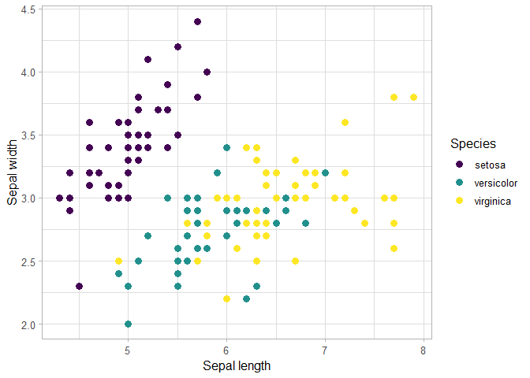

    library(ggplot2)
    library(janitor)

    ## Warning: package 'janitor' was built under R version 4.1.3

    ## 
    ## Attaching package: 'janitor'

    ## The following objects are masked from 'package:stats':
    ## 
    ##     chisq.test, fisher.test

    library(dplyr)

    ## 
    ## Attaching package: 'dplyr'

    ## The following objects are masked from 'package:stats':
    ## 
    ##     filter, lag

    ## The following objects are masked from 'package:base':
    ## 
    ##     intersect, setdiff, setequal, union

Let’s create a scatterplot with `ggplot2` and the iris dataset

## Explore the data

    iris_clean <- iris %>% 
      clean_names()

    glimpse(iris_clean)

    ## Rows: 150
    ## Columns: 5
    ## $ sepal_length <dbl> 5.1, 4.9, 4.7, 4.6, 5.0, 5.4, 4.6, 5.0, 4.4, 4.9, 5.4, 4.8, 4.8, 4.3, 5.8, 5.7, 5.4, 5.1, 5.7, 5.1, 5.4, 5.1, 4.6, 5.1, 4~
    ## $ sepal_width  <dbl> 3.5, 3.0, 3.2, 3.1, 3.6, 3.9, 3.4, 3.4, 2.9, 3.1, 3.7, 3.4, 3.0, 3.0, 4.0, 4.4, 3.9, 3.5, 3.8, 3.8, 3.4, 3.7, 3.6, 3.3, 3~
    ## $ petal_length <dbl> 1.4, 1.4, 1.3, 1.5, 1.4, 1.7, 1.4, 1.5, 1.4, 1.5, 1.5, 1.6, 1.4, 1.1, 1.2, 1.5, 1.3, 1.4, 1.7, 1.5, 1.7, 1.5, 1.0, 1.7, 1~
    ## $ petal_width  <dbl> 0.2, 0.2, 0.2, 0.2, 0.2, 0.4, 0.3, 0.2, 0.2, 0.1, 0.2, 0.2, 0.1, 0.1, 0.2, 0.4, 0.4, 0.3, 0.3, 0.3, 0.2, 0.4, 0.2, 0.5, 0~
    ## $ species      <fct> setosa, setosa, setosa, setosa, setosa, setosa, setosa, setosa, setosa, setosa, setosa, setosa, setosa, setosa, setosa, s~

## Create a scatterplot

    ggplot(data = iris_clean, aes(x = sepal_length, y = sepal_width, color = species)) +
      geom_point(size = 3) +
      scale_color_viridis_d() +
      labs(x = "Sepal length",
           y = "Sepal width",
           color = "Species") +
      theme_light(base_size = 12)

